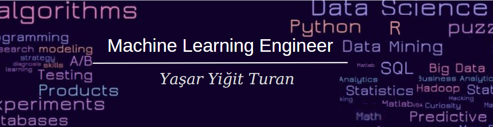

  

  <h1>Hello 👋, I'm Yaşar Yiğit Turan</h1>
  <h3>Second-year student at Hacettepe University, Statistics Department</h3>   
  

    I'm interested in Machine Learning and Data Science, currently developing my skills through passionate projects. Throughout my academic journey, I seamlessly combine the theoretical knowledge I've acquired with my software capabilities, resulting in an ever-evolving skill set.
  

  <a href="YOUR_WEBSITE_URL">👨‍💻 My Website</a> | <a href="mailto:yasarturan@hacettepe.edu.tr">📫 Contact Me</a> | <a href="LINK_TO_EXPERIENCES">📄 Know About My Experiences</a>

  
  

<h3 align="left">Connect With Me:</h3>

  
  
  

<h3>Tools and Technologies</h3>

  <!-- Python -->
  
  
  <!-- R -->
  

  <!-- PyCharm -->
  

  <!-- VS Code -->
  
  
  <!-- Jupyter -->
  

  <!-- PostgreSQL -->
  

  <!-- Git -->
  

  <!-- Veri Bilimi Kütüphaneleri -->
  
  
  
  
  <!-- Diğer veri bilimi kütüphaneleri buraya eklenebilir -->
  
  <!-- Makine Öğrenimi Kütüphaneleri -->
  
  
  <!-- Diğer makine öğrenimi kütüphaneleri buraya eklenebilir -->

 <!-- GitHub Stats -->

  <h3 align="left">GitHub Stats:</h3>
  

    
    
  

<!-- Top Languages -->

  
  

    
  

<!-- Visitor Count -->

  

    
  

<!-- Medium Blogs -->

  

    
  

<!--
**yyigitturan/yyigitturan** is a ✨ _special_ ✨ repository because its `README.md` (this file) appears on your GitHub profile.

Here are some ideas to get you started:

- 🔭 I’m currently working on ...
- 🌱 I’m currently learning ...
- 👯 I’m looking to collaborate on ...
- 🤔 I’m looking for help with ...
- 💬 Ask me about ...
- 📫 How to reach me: ...
- 😄 Pronouns: ...
- ⚡ Fun fact: ...
-->
